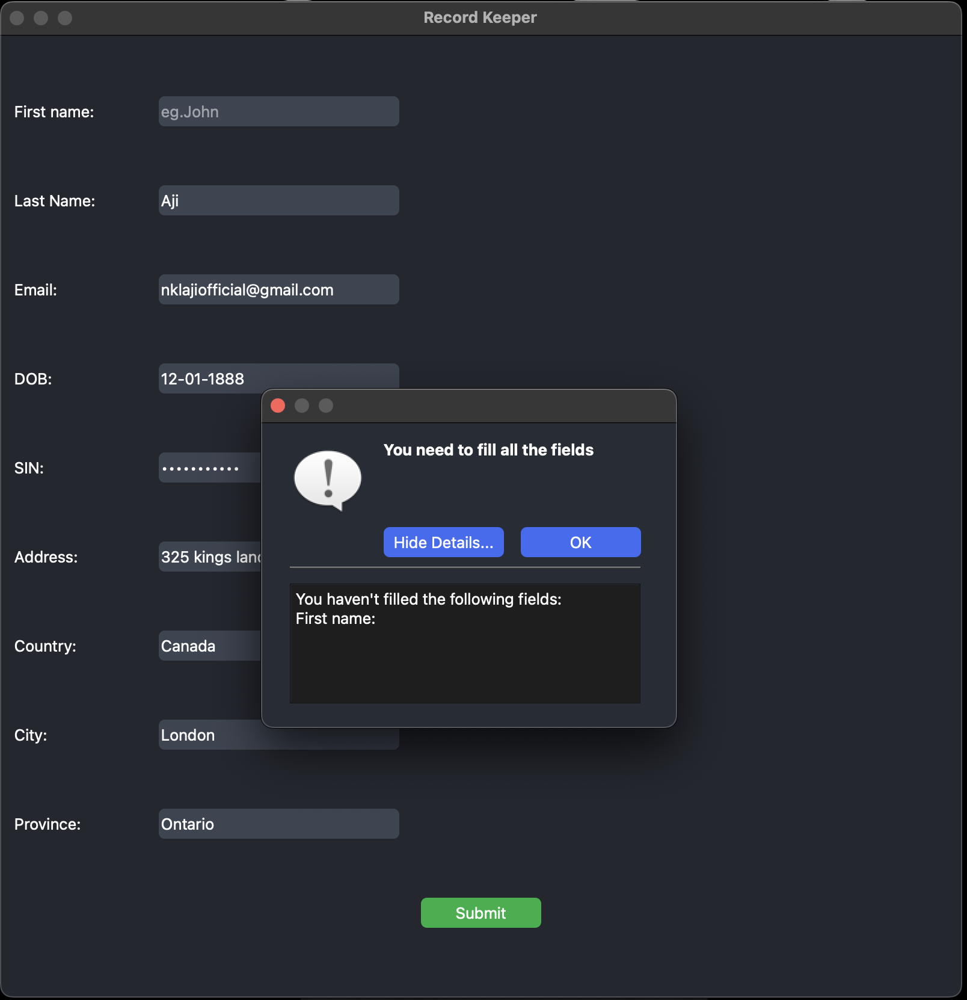

# Record Keeper

**Record Keeper is a PyQt5 based desktop application. It is designed to collect, validate, and store user informationin an SQLite database. Record Keeper features a clean GUI and it allows users to enter their personal details such us:**

- First Name
- Last Name
- Email
- Date of Birth
- Social Insurance Number (SIN)
- Address
- Country
- City
- Province

**The Program also validates SIN, Date of Birth and email to make sure the user don't enter an invalid data**

 

## Record Viewer

**Record Viewer is a part of the Record Keeper application. It fetchs all the data from the database and shows the data in a clean GUI table**